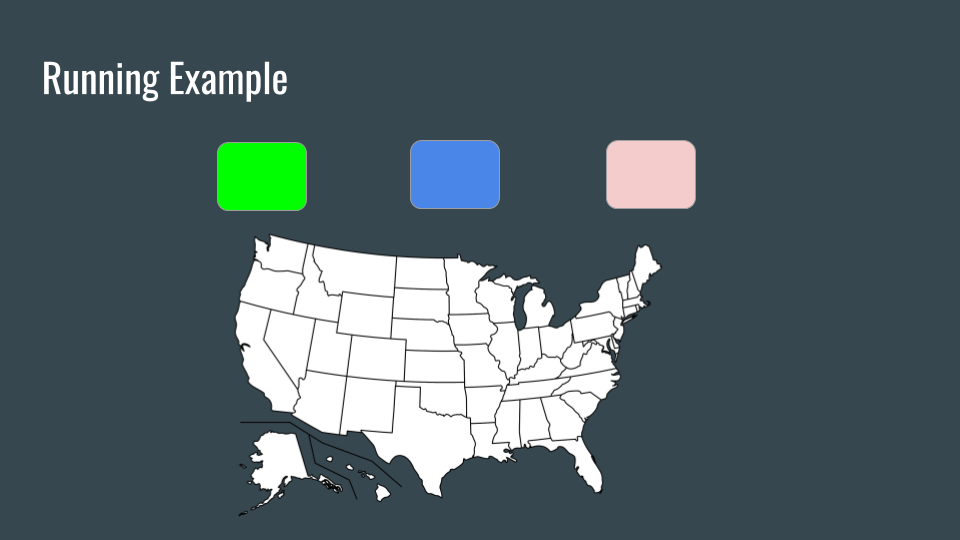
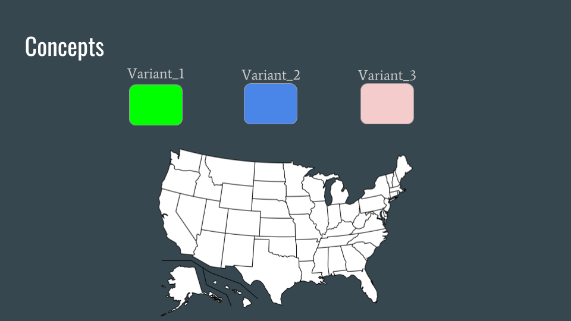
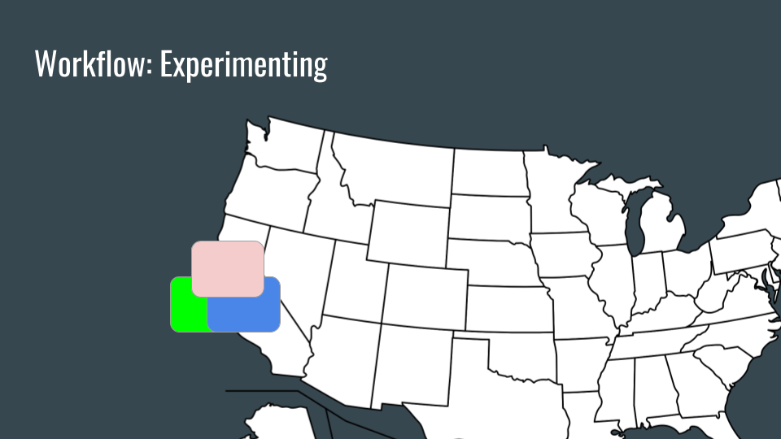
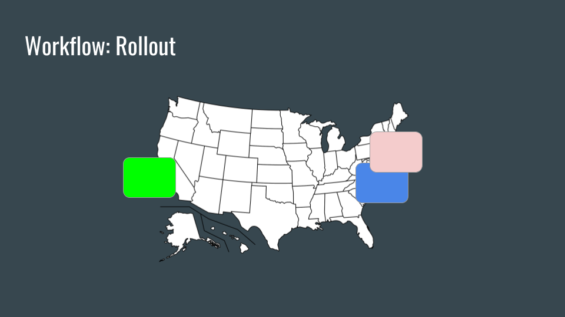
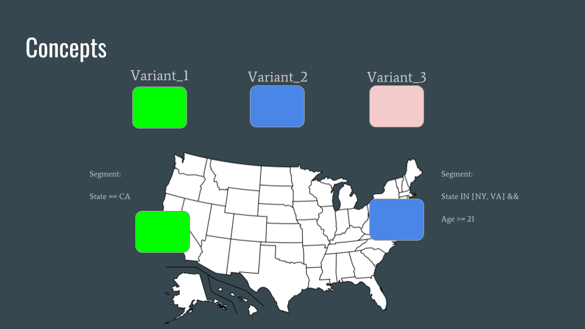
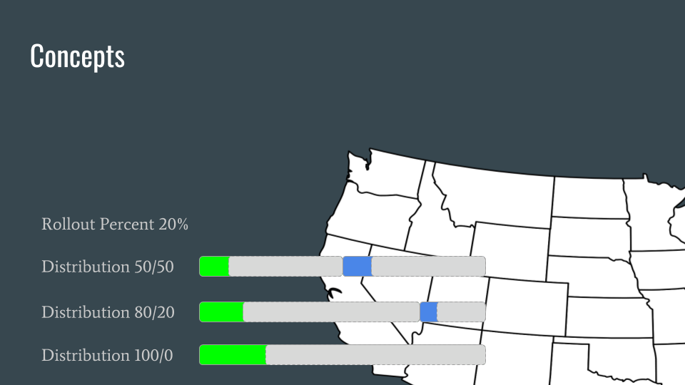
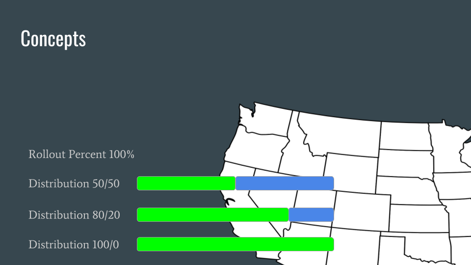
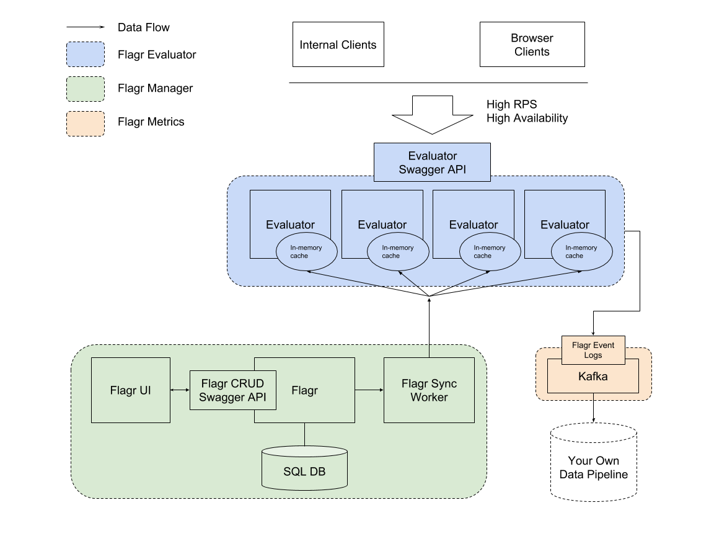

# Flagr Overview

## Flagr Concepts

The definitions of the following concepts are in [API doc](https://checkr.github.io/flagr/api_docs).

- **Flag**. It can be a feature flag, an experiment, or a configuration.
- **Variant** represents the possible variation of a flag. For example, control/treatment, green/yellow/red, etc.
- **Variant Attachment** represents the dynamic configuration of a variant. For example, if you have a variant for the `green` button, you can dynamically control what's the hex color of green you want to use (e.g. `{"hex_color": "#42b983"}`).
- **Segment** represents the segmentation, i.e. the set of audience we want to target. Segment is the smallest unit of a component we can analyze in Flagr Metrics.
- **Constraint** represents rules that we can use to define the audience of the segment. In other words, the audience in the segment is defined by a set of constraints. Specifically, in Flagr, the constraints are connected with `AND` in a segment.
- **Distribution** represents the distribution of variants in a segment.
- **Entity** represents the context of what we are going to assign the variant on. Usually, Flagr expects the context coming with the entity, so that one can define constraints based on the context of the entity.
- **Rollout** and deterministic random logic. The goal here is to ensure deterministic and persistent evaluation result for entities. Steps to evaluating a flag given an entity context:
    - Take the unique ID from the entity, hash it using a hash function that has a uniform distribution (e.g. CRC32, MD5).
    - Take the hash value (base 10) and mod 1000. 1000 is the total number of buckets used in Flagr.
    - Consider the distribution. For example, 50/50 split for control and treatment means 0-499 for control and 500-999 for treatment.
    - Consider the rollout percentage. For example, 10% rollout means only the first 10% of the control buckets (again, use the previous step example, 0-49 out of 0-499 will be rolled out to control experience).

## Flagr Running Example

- Suppose we want to roll out a new button to users in US, and we don't know which color works best. The colors `green/blue/pink` are three variants of the flag.

- We may want to expose the flag to a small set of users, for example users in California. So users in California is a segment.

- Later, we learned that users in CA liked the green button, people in NY liked the pink button, and people in DC liked the blue button. So we will have three segments, and each segment is defined by the constraint: `state == ?`. The segment can also be defined by multiple constraints. For example, `state == NY AND Age >= 21`

- To run A/B testing for this flag, we can try `50%/50%` (Distribution) of `green/blue`, and test this only on `20%` (Rollout Percent) of the users in the `CA` segment. Later on we can set the rollout percent to be `100%` so that every user in `CA` will get either green or blue with `50%` of the chance. And of course, if you want to roll it out to `100%` green to `100%` of the users, just set distribution to be `100%/0%` green/blue and `100%` rollout percentage.

## Flagr Architecture

There are three components in the flagr, Flagr Evaluator, Flagr Manager, and Flagr Metrics.

- Flagr Evaluator. Flagr evaluator evaluates the incoming requests.
- Flagr Manager. Flagr manager is the CRUD gateway. All the mutations of flags happen here.
- Flagr Metrics. Flagr metrics is the data pipeline to collect evaluation results. Currently Flagr only supports Kafka as the pipeline.

